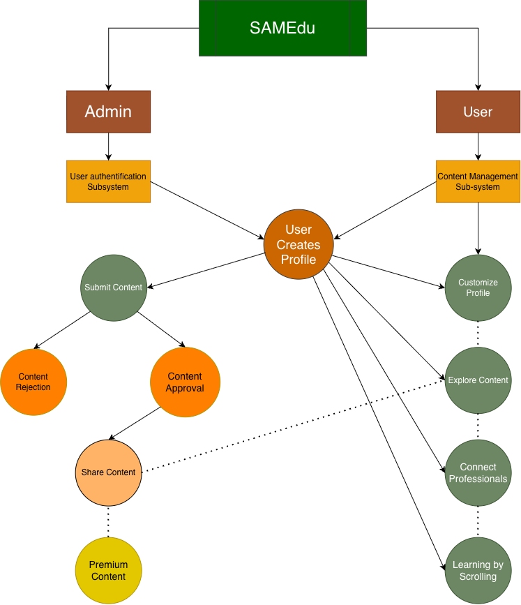
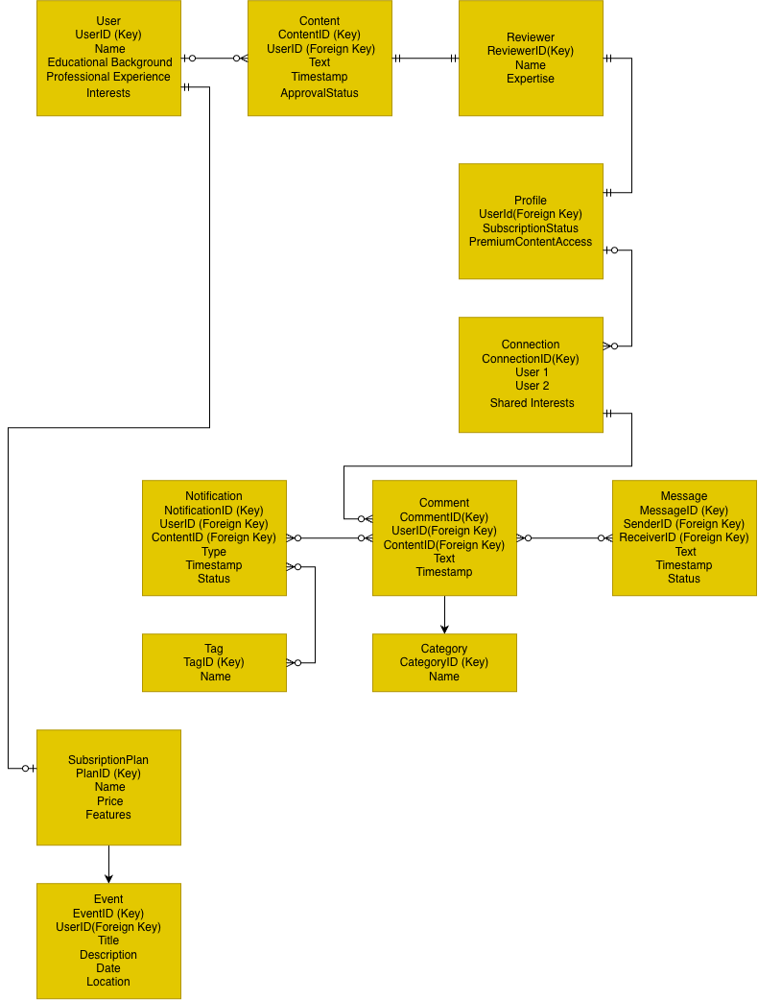
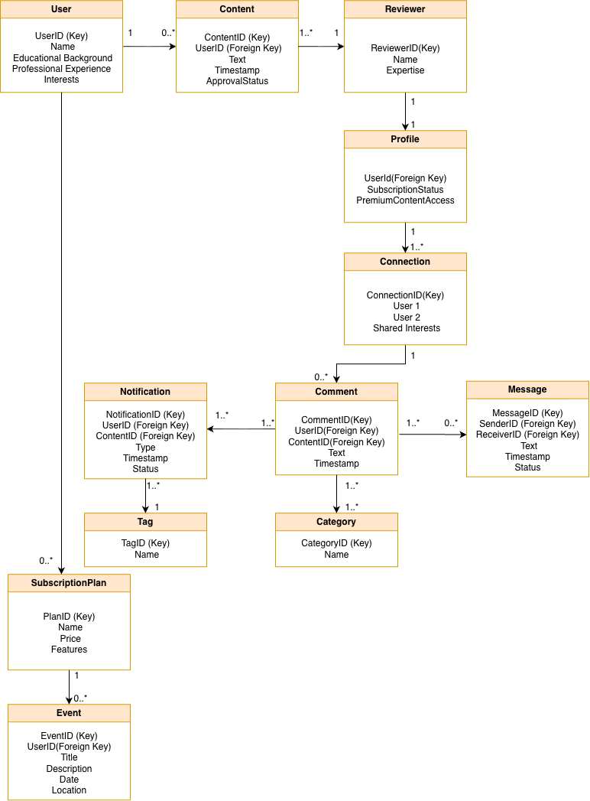
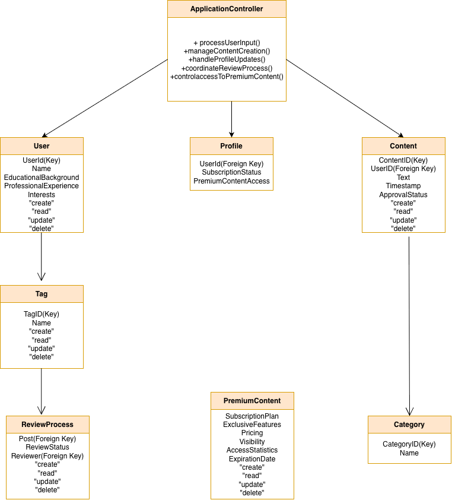
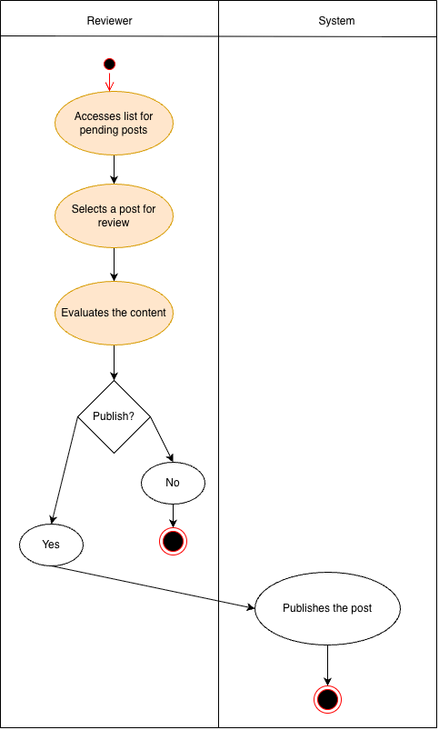
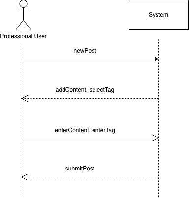
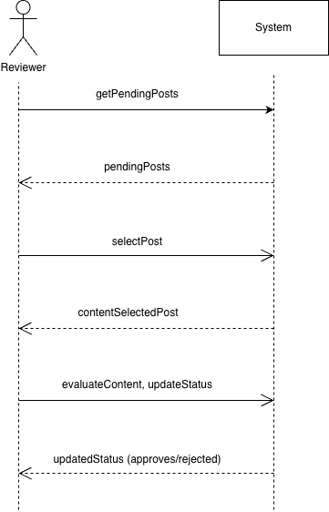

# SAMEdu System Design

SAMEdu is a systems analysis and design project for an educational social media platform focused on knowledge sharing between verified professionals and learners.

The platform concept combines familiar social media interactions with professional verification, expertise-based content sharing, content review, networking, and educational discovery.

## Project Overview

SAMEdu was designed to explore how a social media platform could provide a more focused environment for educational and professional content.

The system supports two primary user groups:

- **Professional users** who can contribute content within their verified areas of expertise
- **Learners** who can discover and interact with educational content based on their interests

Key platform concepts include professional verification, content review, educational content discovery, professional networking, premium content, user profiles, notifications, and feedback.

## System Design

The project includes analysis and modeling across multiple stages of the software design process:

- Functional and non-functional requirements
- User stories and acceptance criteria
- Use cases and detailed use case descriptions
- CRUD analysis
- Entity Relationship Diagram (ERD)
- Domain class modeling
- Inheritance modeling
- Subsystem design
- Controller class design
- CRC cards
- Activity diagrams
- Communication diagrams
- Sequence diagrams
- User interface mockups

## Key Diagrams

### Use Case Diagram



### Entity Relationship Diagram



### Domain Class Diagram



### Controller Class Diagram



### Content Approval Activity Diagram



### Content Sharing Sequence Diagram



### Content Approval Sequence Diagram



## Repository Structure

```text
samedu-system-design/
├── diagrams/
│   ├── activity/
│   ├── crc-cards/
│   └── .drawio source files
├── documentation/
│   └── SAMEdu.pdf
├── images/
│   └── exported diagram images
└── README.md
```

## Documentation

The full systems analysis and design document includes the platform concept, requirements, user stories, use cases, system models, UML diagrams, interface designs, and FAQ.

See: `documentation/SAMEdu.pdf`

## Tools & Concepts

- Systems Analysis & Design
- UML
- Requirements Analysis
- Use Case Modeling
- Entity Relationship Modeling
- Object-Oriented Analysis
- CRUD Analysis
- Activity Diagrams
- Sequence Diagrams
- Communication Diagrams
- CRC Cards
- UI Design
- diagrams.net / Draw.io

## Project Type

Academic systems analysis and design project developed at Webster University.

## Author

Anna Sargsyan  
B.S. Computer Science, Webster University
